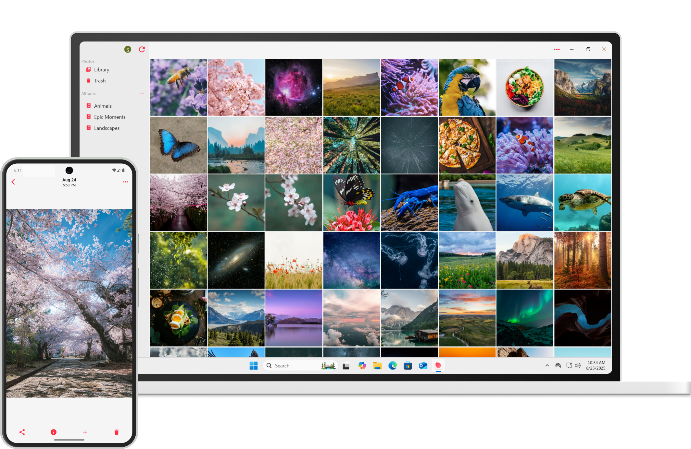

# Amphi Photos

[웹사이트](https://amphi.site)

[English](../README.md) • [한국어](README_KO.md)

Amphi Photos는 직접 큐레이션하는 우아한 미디어 허브입니다. 오픈 소스이자 셀프 호스팅을 지원하며, 모든 플랫폼에서 다채롭게 활용할 수 있습니다.

## 설치

### 앱

**Android**: [Play Store](https://play.google.com/store/apps/details?id=com.amphi.photos) • [APK](https://github.com/amphi2024/photos/releases/latest)

**iOS**: [App Store](https://apps.apple.com/app/amphi-photos/id6751439356)

**Windows**: [Scoop](https://github.com/amphi2024/scoop-bucket) • [EXE](https://github.com/amphi2024/photos/releases/latest) • [ZIP](https://github.com/amphi2024/photos/releases/latest)

**macOS**: [Homebrew](https://github.com/amphi2024/homebrew-amphi) • [DMG](https://github.com/amphi2024/photos/releases/latest)

**Linux**: [AUR](https://aur.archlinux.org/packages/amphi-photos) • [Flatpak](https://github.com/amphi2024/amphi-flatpak) • [Snap](https://snapcraft.io/amphi-photos) • [DEB](https://github.com/amphi2024/photos/releases/latest) • [RPM](https://github.com/amphi2024/photos/releases/latest) • [TAR](https://github.com/amphi2024/photos/releases/latest)

### 서버

마인크래프트 서버처럼, `.jar` 파일을 다운로드해서 JVM에서 실행하는 것만으로 간단하게 서버를 구성할 수 있습니다.

시작하기: [웹사이트](https://amphi.site/server) • [GitHub](https://github.com/amphi2024/server)

### 다른앱

서버를 셋업하고 나면, 다른 앱의 데이터도 동기화할 수 있습니다:
- [Amphi Music](https://github.com/amphi2024/music)
- [Amphi Photos](https://github.com/amphi2024/photos)
- [Amphi Cloud](https://github.com/amphi2024/cloud)

## 기여하기

아래와 같은 다양한 방식의 기여를 언제나 환영합니다:

- 번역하기
- 버그고치기
- 미완성된 기능들 구현 (특히 코드에서 TODO로 표시한 부분)

모든 기여가 다 받아들여지지 않을 수 있지만, 여러분의 노력과 관심에는 진심으로 감사드립니다.

기여하기:

- 이메일 보내기: support@amphi.site
- [Weblate](https://hosted.weblate.org/projects/amphi-photos)에서 앱 번역하기
- Pull Request 생성하기: [기여 가이드](CONTRIBUTING_KO.md)